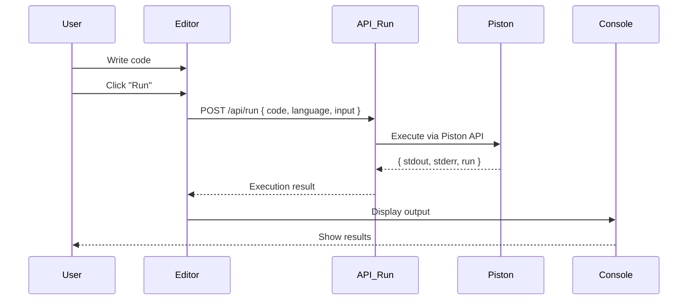
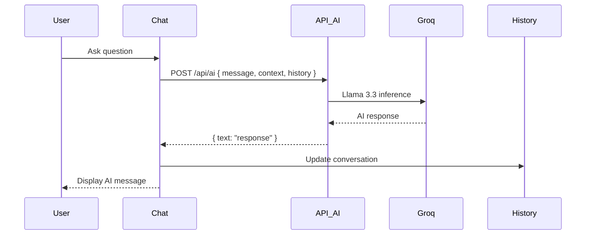
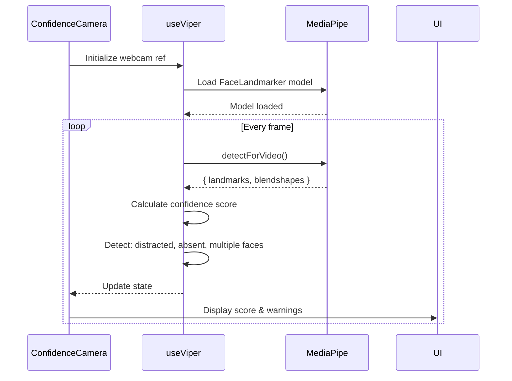
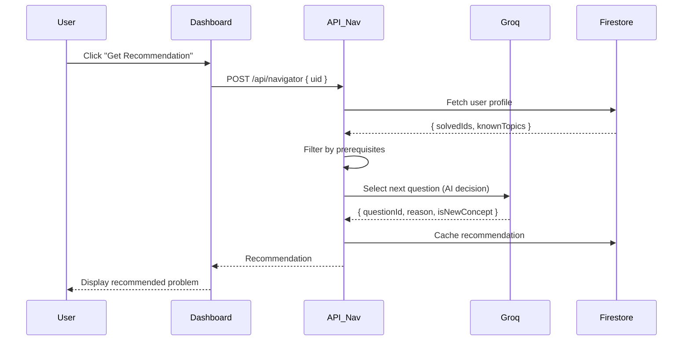

# AlgoSensei Architecture Documentation

## System Architecture Overview

AlgoSensei is a modern, AI-powered algorithmic mastery platform built with Next.js 16, featuring real-time emotion tracking, voice interaction, and intelligent problem recommendations.

---

## High-Level Architecture

```
┌─────────────────────────────────────────────────────────────────────┐
│                         CLIENT (Browser)                            │
├─────────────────────────────────────────────────────────────────────┤
│                                                                     │
│  ┌──────────────┐  ┌──────────────┐  ┌───────────────────────┐   │
│  │  Dashboard   │  │  Workspace   │  │  Interview Mode       │   │
│  │              │  │              │  │                       │   │
│  │ - Stats      │  │ - Editor     │  │ - JARVIS AI          │   │
│  │ - Categories │  │ - Console    │  │ - Hawkeye (Code)     │   │
│  │ - Progress   │  │ - AI Chat    │  │ - Viper (Webcam)     │   │
│  └──────────────┘  └──────────────┘  └───────────────────────┘   │
│                                                                     │
│  ┌──────────────────────────────────────────────────────────┐    │
│  │           Common Components                              │    │
│  │  - ConfidenceCamera (Webcam + MediaPipe)                │    │
│  │  - Monaco Editor                                          │    │
│  │  - Voice Interface                                        │    │
│  └──────────────────────────────────────────────────────────┘    │
└─────────────────────────────────────────────────────────────────────┘
                              ↕ HTTPS
┌─────────────────────────────────────────────────────────────────────┐
│                    NEXT.JS API ROUTES (Server)                      │
├─────────────────────────────────────────────────────────────────────┤
│                                                                     │
│  /api/ai            → VIPER AI Assistant (Groq Llama 3.3)         │
│  /api/ai/watch      → Code Watch (Real-time Analysis)             │
│  /api/run           → Code Execution (Piston API)                 │
│  /api/translate     → Language Translation (Groq)                 │
│  /api/interview     → JARVIS Interview AI (Groq)                  │
│  /api/navigator     → Problem Recommendation (Groq + Firestore)   │
│  /api/navigator/recommend → Adaptive Curriculum (AI-driven)       │
│                                                                     │
└─────────────────────────────────────────────────────────────────────┘
          ↕                    ↕                    ↕
┌──────────────────┐  ┌──────────────────┐  ┌─────────────────┐
│  External APIs   │  │  Firebase        │  │  MediaPipe ML   │
├──────────────────┤  ├──────────────────┤  ├─────────────────┤
│                  │  │                  │  │                 │
│ • Groq API       │  │ • Firestore DB   │  │ • Face Detect   │
│   (Llama 3.3)    │  │ • Auth           │  │ • Emotion API   │
│                  │  │ • User Profiles  │  │ • Blendshapes   │
│ • Piston API     │  │ • Progress Data  │  │                 │
│   (Code Exec)    │  │                  │  │                 │
│                  │  │                  │  │                 │
└──────────────────┘  └──────────────────┘  └─────────────────┘
```

---

## Component Architecture

### Frontend Structure

```
src/
├── app/                          # Next.js App Router
│   ├── dashboard/                # Main dashboard
│   ├── workspace/[id]/           # Coding workspace
│   ├── interview/[questionId]/   # Interview mode
│   ├── profile/                  # User profile
│   ├── translator/               # Code translator
│   └── api/                      # API routes (see below)
│
├── components/
│   ├── workspace/
│   │   ├── ConfidenceCamera.tsx  # Webcam + VIPER integration
│   │   ├── Editor.tsx            # Monaco code editor
│   │   ├── Console.tsx           # Test results display
│   │   └── AIChat.tsx            # AI assistant interface
│   │
│   ├── profile/
│   │   ├── StatsCard.tsx         # User statistics
│   │   └── SkillRadar.tsx        # Victory chart radar
│   │
│   └── ui/                       # Reusable UI components
│
├── hooks/
│   ├── useViper.ts               # Webcam emotion detection
│   ├── useVoiceInterface.ts      # Speech recognition/synthesis
│   ├── useSenseiWatch.ts         # Real-time code analysis
│   └── useInterviewLogic.ts      # Interview state management
│
├── lib/
│   ├── firebase.ts               # Firebase config & auth
│   ├── groq.ts                   # Groq API client
│   ├── codeRunner.ts             # Piston integration
│   └── allQuestions.ts           # Problem database
│
└── data/                         # Problem datasets
    ├── arrays.ts
    ├── graphs.ts
    ├── dp_1d.ts
    └── ...
```

---

## Data Flow Diagrams

### 1. Code Execution Flow



### 2. AI Assistant Flow (VIPER)



### 3. Webcam Emotion Detection Flow



### 4. Problem Recommendation Flow



---

## Technology Stack

### Frontend Layer
- **Framework**: Next.js 16 (App Router, React 19)
- **Language**: TypeScript
- **Styling**: Tailwind CSS 4
- **Animation**: Framer Motion
- **Code Editor**: Monaco Editor
- **Icons**: Lucide React
- **Charts**: Victory (Radar Charts)

### Backend Layer
- **Runtime**: Node.js 18+
- **API Routes**: Next.js API Routes
- **Code Execution**: Piston API (External)

### AI & ML Layer
- **LLM Provider**: Groq (Llama 3.3 70B)
- **Vision ML**: MediaPipe Tasks Vision (Face Landmarker)
- **Speech**: Web Speech API (Browser Native)

### Data Layer
- **Database**: Firebase Firestore
- **Authentication**: Firebase Auth
- **Storage**: Firebase Storage (for avatars)

---

## Key Features Architecture

### 1. **VIPER (Visual Intelligence & Performance Emotion Recognition)**

**Purpose**: Real-time emotion and focus tracking via webcam

**Technology Stack**:
- MediaPipe Face Landmarker (478 facial landmarks)
- Face Blendshapes (52 expression categories)
- Custom confidence scoring algorithm

**Detection Capabilities**:
- Face presence detection
- Multiple face detection (cheating prevention)
- Head pose estimation (yaw offset)
- Micro-expressions: stress, confidence, distraction
- Mood classification: Neutral, Confident, Stressed, Distracted, Misbehaving

**Privacy**: All processing happens client-side. No video data is transmitted to servers.

---

### 2. **Code Watch (Real-time Code Analysis)**

**Purpose**: Background AI monitoring for anti-patterns

**Triggers**:
- Time complexity disasters (O(n³), infinite loops)
- Security risks (eval() usage)
- Hard-coded test cases

**Output**: JSON warnings displayed as non-intrusive notifications

---

### 3. **JARVIS Interview Mode**

**Purpose**: Simulated technical interview experience

**AI Persona**: Senior Principal Engineer at Google

**Stages**:
1. **Gatekeeping**: Rapid-fire definition questions
2. **Logic Visualization**: Explain data structures verbally
3. **Edge Case Trap**: Challenge with breaking inputs
4. **Rebuttal**: Defend weaknesses
5. **Verdict**: JSON feedback with scores

**Integration**:
- **Hawkeye**: Monitors code in real-time
- **VIPER**: Tracks body language and confidence

---

### 4. **Adaptive Curriculum (Navigator AI)**

**Purpose**: Intelligent next-problem recommendation

**Decision Logic**:
- **Skill Trees**: Prerequisite-based unlocking
- **Performance Analysis**: Success rate, time taken
- **Lateral Shifts**: Prevent boredom with diverse topics
- **Remedial Paths**: Adjust difficulty on struggle detection

**Implementation**:
- Groq AI analyzes user history
- Firestore caches recommendations
- Direct bridges between problems (e.g., Two Sum → Two Sum II)

---

## Security & Privacy

### Data Privacy
- **Webcam Data**: Processed entirely client-side via MediaPipe. No video streams uploaded.
- **Code Data**: Stored in Firestore with user authentication
- **API Keys**: Server-side only (Groq, Firebase Admin)

### Authentication
- Firebase Auth (Email/Password)
- Protected API routes verify authentication tokens

### Rate Limiting
- Groq API: Natural rate limits via SDK
- Piston API: Throttled by external provider

---

## Performance Optimizations

1. **Code Editor**: Monaco runs in Web Worker
2. **AI Responses**: Streaming disabled for stability; response caching considered
3. **Webcam ML**: GPU acceleration via MediaPipe
4. **Problem Data**: Static JSON imports (no runtime fetching)
5. **Firestore Queries**: Indexed fields for user profiles

---

## Deployment Architecture

```
┌──────────────────────────────────────┐
│        Vercel / Cloud Platform       │
├──────────────────────────────────────┤
│                                      │
│  Next.js App (SSR + Static)         │
│  • Auto-scaling Edge Functions      │
│  • CDN for static assets            │
│  • Environment variables (secrets)  │
│                                      │
└──────────────────────────────────────┘
           ↕              ↕
┌──────────────────┐  ┌──────────────────┐
│  Firebase        │  │  CDN (Static)    │
│  • Firestore     │  │  • MediaPipe     │
│  • Auth          │  │  • Monaco        │
└──────────────────┘  └──────────────────┘
```

**Build Process**:
1. `npm run build` → Static optimization
2. Environment variables injected
3. API routes deployed as serverless functions
4. Static assets pushed to CDN

---

## Future Architecture Enhancements

1. **WebSockets**: Real-time collaborative coding
2. **Redis Cache**: Cache AI responses and recommendations
3. **PostgreSQL**: Migrate from Firestore for complex queries
4. **CDN for Code Execution**: Self-hosted Piston instance
5. **A/B Testing**: Experiment framework for AI prompts
6. **Analytics Pipeline**: User behavior tracking with privacy focus

---

**Document Version**: 1.0  
**Last Updated**: January 31, 2026  
**Author**: VENOMRK22 / 4BITS
